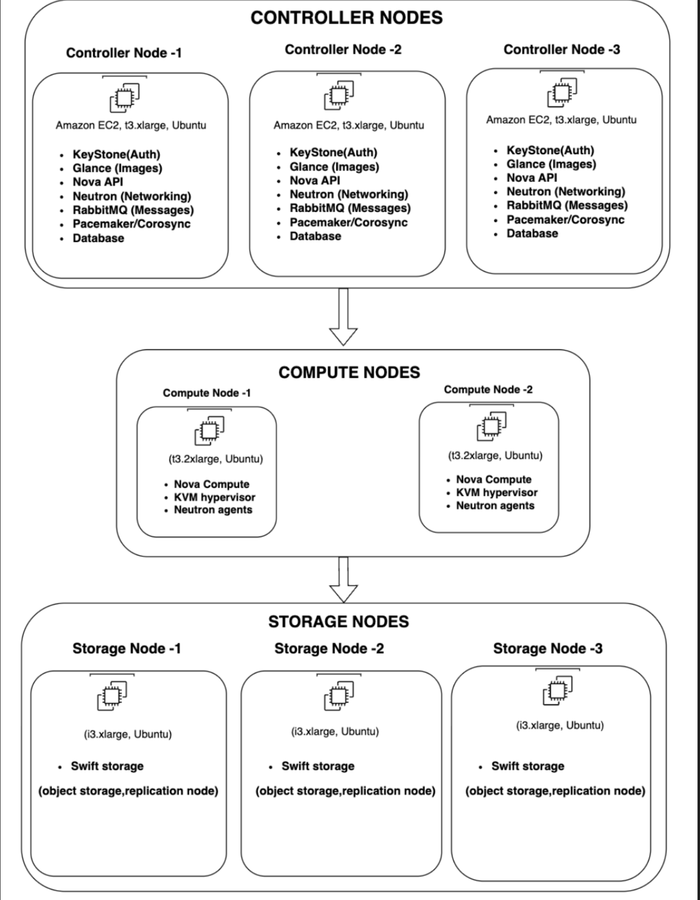
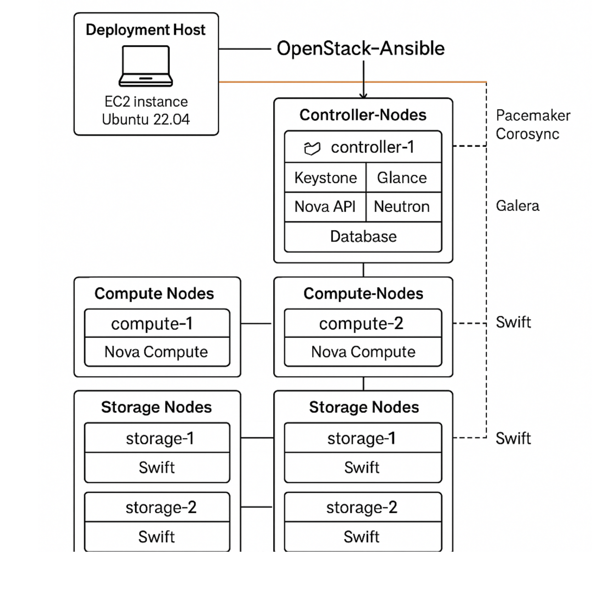

# Automated High Availability OpenStack Deployment with Ansible

## Overview

This document describes the design and implementation of a fully automated, highly available (HA) OpenStack environment using Ansible. While initial considerations might include tools like DevStack for rapid prototyping, this solution specifically leverages OpenStack-Ansible to achieve a production-grade, highly available deployment. The solution runs on Amazon EC2 instances or local virtualized environments with Ubuntu Jammy (22.04). It covers the deployment of Compute (Nova), Storage (Swift), and Database (Trove) services, addressing requirements around HA, networking, security, error handling, monitoring, scalability, and validation.

## Core Architectural Principles for HA

A robust OpenStack HA deployment relies on distributing critical services across multiple dedicated nodes. The architecture typically comprises:

* **Deployment Host**: A dedicated EC2 instance (or similar VM) running automation tools like Ansible to orchestrate the deployment. This host is not part of the OpenStack production cluster itself.
* **Controller Nodes (3+)**: The backbone of the OpenStack control plane. A minimum of three nodes is crucial to establish a quorum for clustering mechanisms, ensuring resilience for API services (Keystone, Nova API, Neutron, Glance, Cinder), database, and message queue.
* **Compute Nodes (2+)**: Responsible for hosting virtual machine instances. Multiple compute nodes enable workload distribution, live migration, and instance evacuation in case of node failure.
* **Storage Nodes (3+)**: Dedicated nodes for object storage (Swift) or block storage (Cinder with Ceph/other distributed storage), minimum of three nodes for Swift ensures 3x data replication for high durability.



## High Availability (HA) Design

* **HA for Controllers**: Use three controller nodes with Pacemaker and Corosync for service failover.
* **Database HA**: Galera multi-master cluster synchronizes MySQL data across controllers.
* **Message Queue HA**: RabbitMQ cluster replicates messages for internal OpenStack communications.
* **Swift Storage HA**: 3-node Swift cluster for triple-replicated, highly available object storage.
* **Trove HA**: Uses Galera to keep user database instances available.
* **Compute HA**: Nova supports instance evacuation and auto-scaling.

## Networking

* **Neutron Networking**:
    * Configure a private network for VM and internal OpenStack traffic.
    * Configure a public network for Internet access/floating IPs.
* **Routers**: Use Neutron routers to connect private and public networks, enabling VMs to reach the Internet.
* **Security Groups**: Define firewall rules to permit/deny traffic (e.g., allow SSH/HTTP, block others).
* **Routing**: Ensure proper routing between private (tenant) and public (external) networks via Neutron.

## Security

* **SSH Key-Pair Authentication**: Users upload public keys to OpenStack, injected into VM instances for secure access.
* **RBAC via Keystone**: Assign users to roles/projects; restrict access to APIs and resources by role.
* **Swift Encryption**: Enable server-side encryption for Swift by configuring the 'keymaster' and 'crypto' middleware in the Swift proxy pipeline.

## Automation Approach

* **Toolchain**: The production-grade, idempotent Ansible playbooks provided by OpenStack-Ansible (OSA).
* **Playbooks**: Automate provisioning, configuration, and deployment of all OpenStack components, including HA configuration.
* **Configuration**: All infrastructure and OpenStack variables defined in YAML (`openstack_user_config.yml`, `user_variables.yml`).
* **Idempotence & Rollback**: Playbooks are idempotent. On failure, fix the error and re-run safely.
* **Error Handling**: Handlers and conditional logic abort on error, and provide logs for troubleshooting.

## Monitoring & Logging

* **Telemetry**: Deploy Ceilometer for collecting resource and event metrics.
* **Centralized Logging**: Collect and forward logs from Nova, Swift, and Trove to a central syslog, Logstash, or ELK stack for monitoring and audit.

## Scalability

* **Nova Auto-Scaling**: Integrate Heat or third-party tools for autoscaling Nova compute nodes based on demand.
* **Swift Scaling**: Add new storage nodes as needed; Swift rings are automatically rebalanced for object distribution.

## Deployment Architecture Design



## Step-by-Step Implementation

Below is a detailed guide for implementing the deployment, based on OpenStack-Ansible.

### Step 1: Provisioning EC2 Instances with Terraform

**Note:** Expecting Terraform is installed in your environment. If not, please follow this article: [Terraform Installation Guide](https://developer.hashicorp.com/terraform/install)

This section outlines how to provision your EC2 instances in AWS, including setting up the necessary security group and automatically enabling SSH root access (a pragmatic decision for testing environments given observed Ansible behavior).

**1. Create your Terraform configuration file (`main.tf`):**

Replace `~/.ssh/id_rsa.pub` with the actual path to your SSH public key on your deployment machine if it's different. Review and adjust the `region`, `ami`, `security_group`, and `instance_type` configurations as per your AWS setup and specific requirements.
**This Terraform setup also generates the `openstack_user_config.yml` file using the `openstack_user_config.yml.tpl` template.**

#### How to run the terraform:
Navigate to the Terraform directory: ``` cd /openstack-ansible/terraform ```

    ```
    terraform init
    terraform plan
    terraform apply --auto-approve
    ```

#### Node Setup:
* 3 Controller nodes (t3.xlarge) for HA (Keystone, Nova API, Neutron, Galera DB).
* 2 Compute nodes (t3.2xlarge) for Nova compute.
* 3 Storage nodes (i3.xlarge) for Swift with 3x replication.

#### Set Up the Deployment Host:
* **Update and upgrade the system:**
    ```
    sudo apt update && sudo apt dist-upgrade -y
    ```

* **Create a Python virtual environment (Python 3.11 recommended) before proceeding with deployment:**
    ```
    sudo add-apt-repository ppa:deadsnakes/ppa -y
    sudo apt update -y
    sudo apt install python3.11 python3.11-venv -y # Ensure venv package is installed
    python3.11 -m venv ansible-venv
    source ansible-venv/bin/activate
    ```

* **Clone the OpenStack-Ansible repository into `/opt/openstack-ansible`:**
    ```
    git clone https://github.com/eldhose-119/Automation.git /opt/openstack-ansible
    ```

* **Transfer and/or Update the Inventory File (`openstack_user_config.yml`):**
    The `openstack_user_config.yml` file was generated earlier by Terraform in your deployment machine's Terraform directory. You need to copy this file to the deployment host at `/etc/openstack_deploy/openstack_user_config.yml`.

    Alternatively, if you prefer to create it manually on the deployment host, use the following structure and update the IP addresses with the private IPs of your provisioned instances:
    ```yaml
    infra_hosts:
    controller-1:
    ip: <private-ip-of-controller-1>
    controller-2:
    ip: <private-ip-of-controller-2>
    controller-3:
    ip: <private-ip-of-controller-3>
    compute_hosts:
    compute-1:
    ip: <private-ip-of-compute-1>
    compute-2:
    ip: <private-ip-of-compute-2>
    storage_hosts:
    storage-1:
    ip: <private-ip-of-storage-1>
    storage-2:
    ip: <private-ip-of-storage-2>
    storage-3:
    ip: <private-ip-of-storage-3>
    ```

* **Create or update the `user_variables.yml` file at `/etc/openstack_deploy/user_variables.yml` with the following information:**
    ```yaml
    galera_cluster_members:
    - controller-1
    - controller-2
    - controller-3
    pacemaker_enabled: true
    swift_replication_count: 3
    ```
### Run the OpenStack-Ansible playbooks in sequence:
   ## Setup hosts:
   ``` openstack-ansible playbooks/setup-hosts.yml ```
   ## Setup infrastructure:
   ``` openstack-ansible playbooks/setup-infrastructure.yml ```
   ## Setup OpenStack services:
   ``` openstack-ansible playbooks/setup-openstack.yml ```

### Ensure HA configurations are applied:
         > Pacemaker and Corosync manage controller services for failover.
         > Galera ensures MySQL replication across controller nodes for Trove.
         > Swift is configured with a replication factor of 3 across storage nodes.

## Validation

| Requirement                 | Validation Step                                                 |
| :-------------------------- | :-------------------------------------------------------------- |
| All OpenStack services up   | `openstack service list` – all services are enabled & up        |
| Compute: Create/SSH into VM | Launch instance, assign floating IP, SSH access works           |
| Swift: Upload/download objects | Use CLI to upload/download and verify replication            |
| Trove: Operational DBs      | Create Trove instance, connect via client, run SQL queries      |
| HA: Controller/service failover | Stop a controller, check failover (Pacemaker, `pcs status`) |

### Troubleshooting Tips
  * Playbook Failures: Review Ansible output/logs, fix the root cause, and re-run (playbooks are idempotent).
  * Service Unreachable: Check network, security group, and firewall settings.
  *  HA Not Working: Verify Pacemaker, Galera, and RabbitMQ cluster health.
  * Swift or Trove Issues: Check logs and ensure node replication status.


### Documentation and Delivery
   *  Architecture Diagrams: Include diagrams showing node roles, network segmentation, and HA components.
   *  Step-by-Step Guide: Provide playbook run instructions.
   *  Validation Checklist: Steps for post-deployment verification.
   *  Ongoing Maintenance: Regularly monitor, back up configs, and apply security updates.
